# TRIDENT Architecture

A layer-by-layer walkthrough of how TRIDENT turns a table row into a classification, and how the data gets there. Written for someone who knows PyTorch and transformers in general but has never opened this repo.

This is a deep dive, not the whole story. For the paper citation, CLI flags, and the config JSON format, see [README.md](../README.md) — this document links back to it rather than repeating it. For MLflow run/tag conventions, see [CONTEXT.md](../CONTEXT.md) and [ADR 0002](adr/0002-curated-cross-validation-mlflow-runs.md).

Every diagram in this doc comes in two flavors: a **theory** version (block names, no numbers — how you'd whiteboard it) and an **implementation** version (real tensor shapes and the actual PyTorch calls that produce them). Skip to whichever one you need.

## Contents

1. [The big picture](#the-big-picture)
2. [Data engineering pipeline](#data-engineering-pipeline)
3. [TabularEmbedder — a table row becomes a token sequence](#tabularembedder--a-table-row-becomes-a-token-sequence)
4. [TabularTransformerEncoder — the shared backbone](#tabulartransformerencoder--the-shared-backbone)
5. [TridentPretrainer — the self-supervised objective](#tridentpretrainer--the-self-supervised-objective)
6. [TridentModel — the fine-tuning / classification head](#tridentmodel--the-fine-tuning--classification-head)
7. [TridentDecoder — reconstructing cell values](#tridentdecoder--reconstructing-cell-values)
8. [End-to-end training orchestration](#end-to-end-training-orchestration)
9. [Hyperparameter → code wiring reference](#hyperparameter--code-wiring-reference)
10. [Running it](#running-it)

---

## The big picture

TRIDENT trains in two stages that **share the same embedder and transformer weights** — fine-tuning doesn't start from scratch, it continues training the exact same `TabularEmbedder`/`TabularTransformerEncoder` instances that pretraining produced, within a given fold.

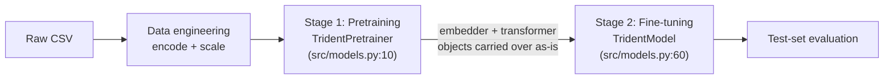

Two things to hold onto before the details:

- **The "sequence" a transformer sees isn't rows over time — it's columns of one row.** Every categorical and numerical column becomes one token, a `[CLS]` token is prepended, and `TabularTransformerEncoder` attends across *columns*, not across time steps or other rows.
- **"Fresh per fold, shared within a fold."** `run_training` (`src/training/runner.py:33`) builds a brand-new `TabularEmbedder` + `TabularTransformerEncoder` for every cross-validation fold, but *within* a fold, `train_and_evaluate_classifier` re-wraps the exact same pretrained embedder/transformer objects — not copies (`src/training/finetuning.py:102-107`).

---

## Data engineering pipeline

Order matters here — `AGENTS.md` calls out preserving the split/scaling order specifically because it's easy to get backwards.

### Loading, encoding, scaling — `prepare_dataset` (`src/training/data.py:15`)

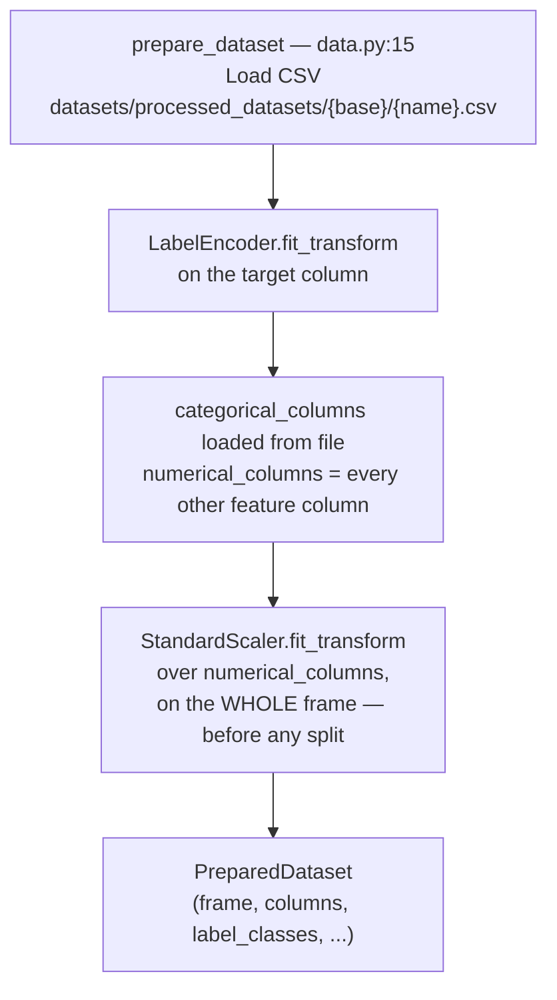

The scaler is fit on the **entire dataset**, before train/val/test indices exist. That's the exact order `AGENTS.md:6` protects — changing it (e.g. fitting the scaler per-fold or per-split) is an algorithm change, not a refactor.

### Building folds — `build_folds` (`src/training/data.py:69`)

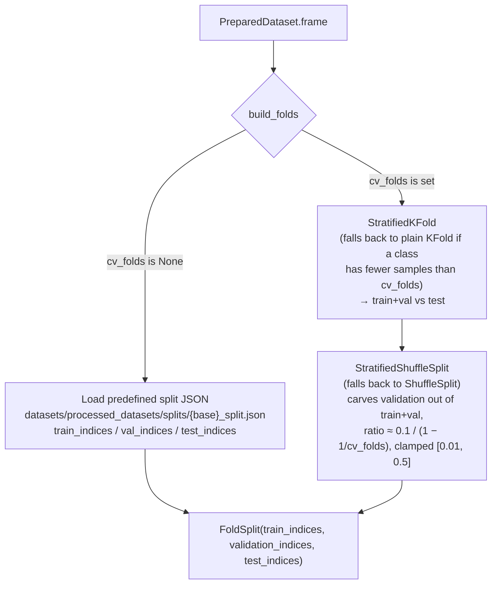

With `cv_folds=None` you get exactly one `FoldSplit` (the legacy fixed split). With `cv_folds=k` you get `k` folds, each with its own train/val/test index sets — this is what the `tags.run_role=parent`/`best_fold`/`worst_fold` MLflow structure in [CONTEXT.md](../CONTEXT.md) is tracking one of.

### Per-epoch masking and batching

This part runs fresh every training step, inside `train_pretrainer` (`src/training/pretraining.py`) and `train_and_evaluate_classifier` (`src/training/finetuning.py`), using `preprocess_table` (`src/utils.py:19`).

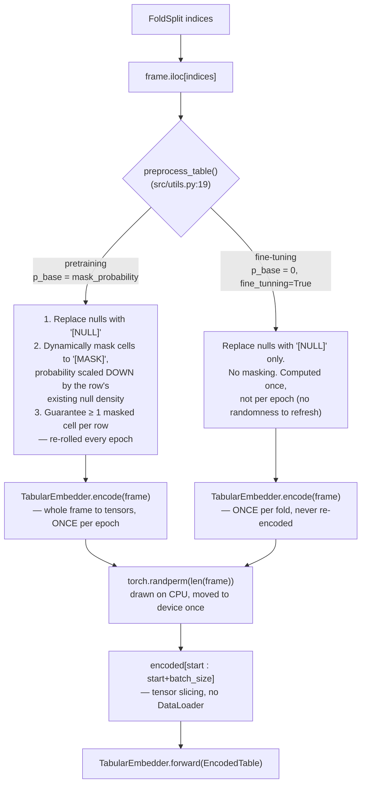

Notes worth knowing:

- Masking never overwrites an already-null cell — `[MASK]` and `[NULL]` are mutually exclusive per cell.
- Pretraining validation is batched the same way as training; fine-tuning validation and test sets run as a **single full-batch forward pass**, no loop.
- **Pandas work happens once per frame, not once per batch.** `TabularEmbedder.encode` (`src/embedder.py`) turns a whole DataFrame into an `EncodedTable`: label-encoded categorical indices, numerical values, `[MASK]`/`[NULL]` flags, and the `[MASK]` position matrix the pre-training loss needs. Pre-training re-encodes the masked frames each epoch because the masks are re-rolled; the clean targets and every fine-tuning frame are encoded a single time.
- `EncodedTable` stores its per-column tensors feature-major, so slicing a batch keeps each column contiguous. `forward` accepts either an `EncodedTable` or a raw DataFrame, so `model(df)` still works for saved models and ad-hoc inference.
- `split_numeric_and_special` (`src/utils.py`) still produces `numeric_values` (float, `0.0` at any special token), `mask_flags` and `null_flags`, but vectorized over whole columns instead of looping cell by cell.

---

## TabularEmbedder — a table row becomes a token sequence

`src/embedder.py:9`. Constructor: `TabularEmbedder(df, categorical_columns, numerical_columns, dimensao, hidden_dim)`. Every categorical column gets **its own** `nn.Embedding` table (not one shared vocabulary across columns); every numerical column gets **its own** 2-layer MLP. `dimensao` is the one embedding width shared by everything downstream — it's what README calls `DIM` and what the transformer calls `d_model`.

### Theory

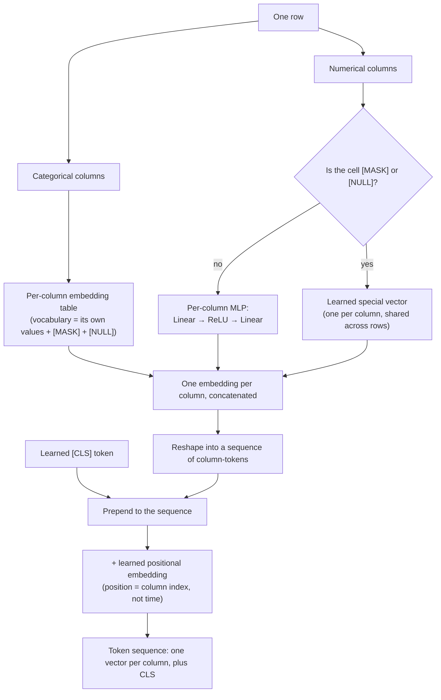

### Implementation

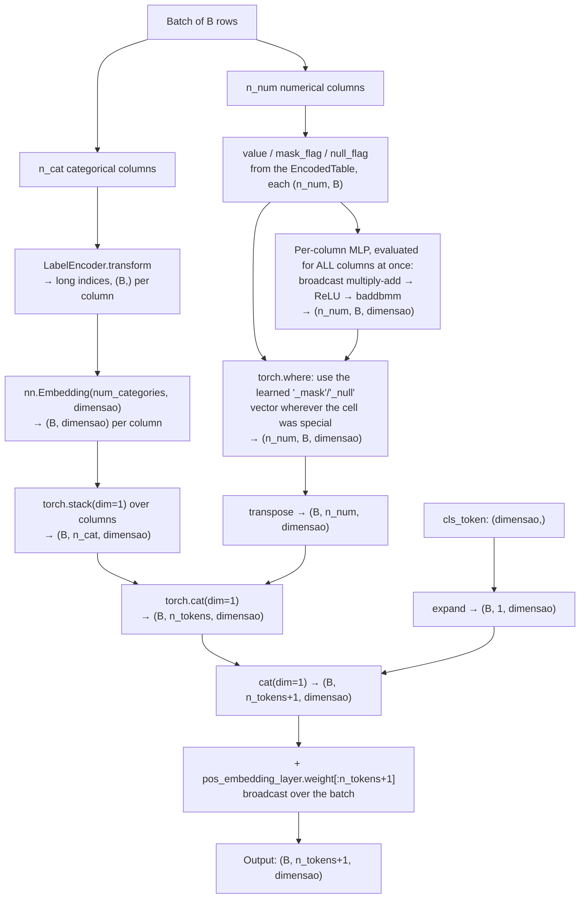

Each numerical column still owns its own `Linear(1, hidden_dim) → ReLU → Linear(hidden_dim, dimensao)` parameters, and they still appear per column in `state_dict`. `forward` gathers those parameters and applies them as one batched operation, so the cost is a fixed number of kernel launches instead of two per column.

`n_tokens = len(categorical_columns) + len(numerical_columns)` is fixed at construction time, and column order is always *categorical columns, then numerical columns*, in list order — that ordering **is** the positional embedding's meaning, so it has to stay identical between training and inference.

> **Initialization gotcha**: `embedder.py` doesn't initialize its own layers. Immediately after construction, `train_pretrainer` (`src/training/pretraining.py:44-48`) runs `model.apply(...)` and re-initializes every `nn.Embedding`/`nn.Linear` in the whole model (embedder included) with Xavier-uniform. But `cls_token` and the `[MASK]`/`[NULL]` special vectors are plain `nn.Parameter(torch.randn(dimensao))` — not `nn.Embedding` or `nn.Linear` — so that sweep skips them. They stay standard-normal initialized.

---

## TabularTransformerEncoder — the shared backbone

`src/transformer.py:92`. A pre-norm transformer encoder, structurally close to a standard BERT-style encoder but bidirectional (no causal mask) and with one global `LayerNorm` before the stack in addition to each layer's own pre-norm.

### The stack

**Theory**

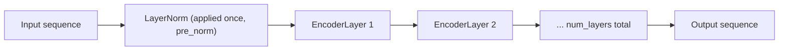

**Implementation**

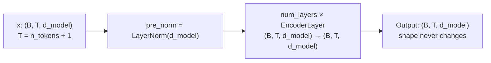

### Inside one `EncoderLayer` (`src/transformer.py:69`)

A standard pre-LN residual block: normalize, sublayer, dropout, add — twice (attention, then feed-forward).

**Theory**

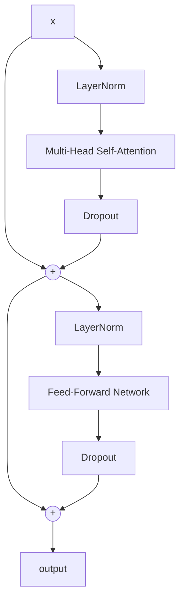

**Implementation**

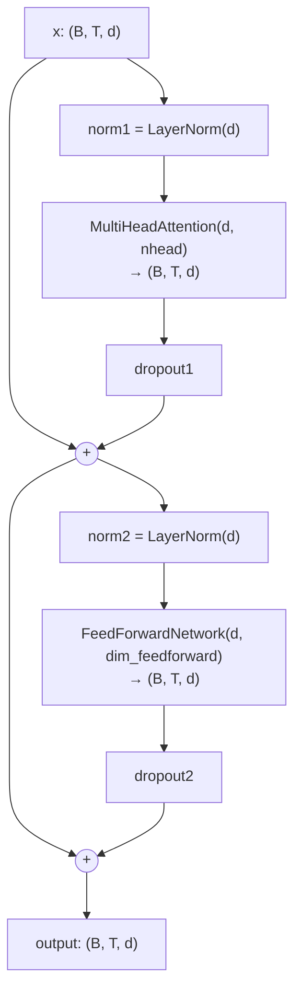

### Inside `MultiHeadAttention` (`src/transformer.py:34`)

`head_dim = hidden_size // num_heads`; `wq`/`wk`/`wv`/`out` are all bias-free linear projections, Xavier-initialized.

**Theory**

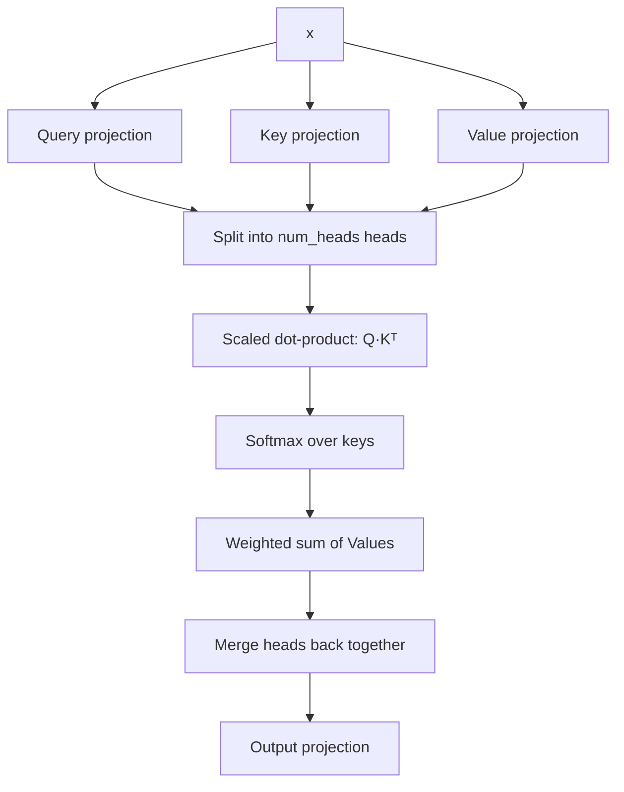

**Implementation**

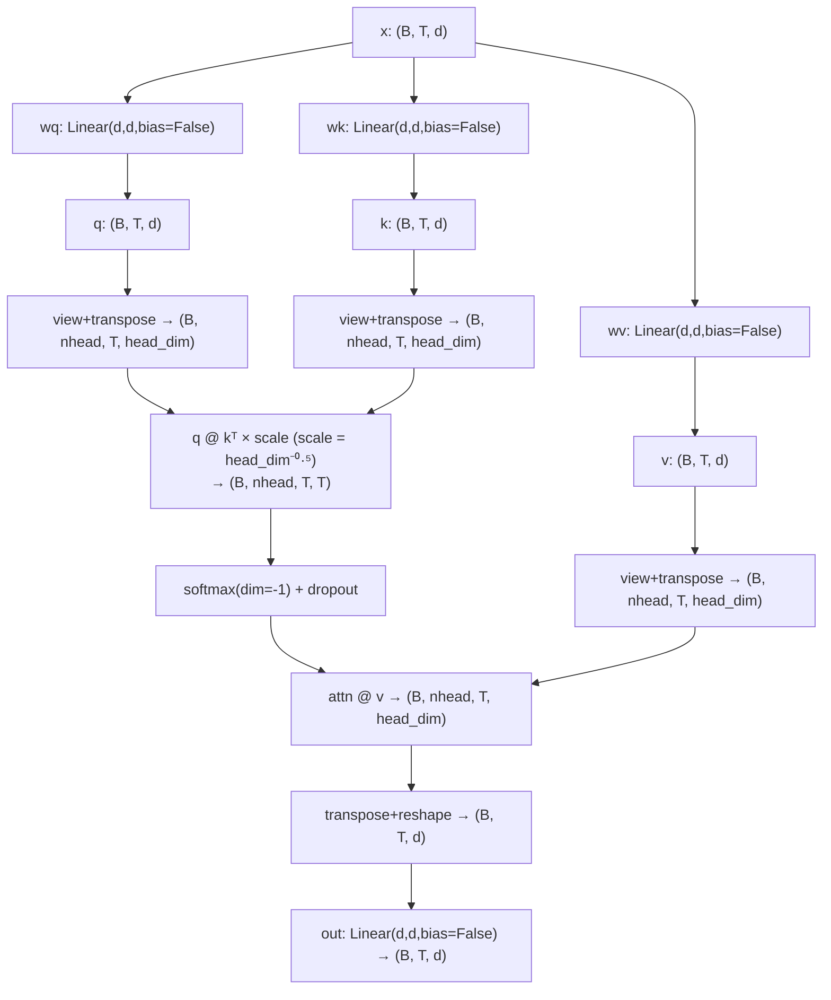

There's no attention mask used anywhere in the current training loops (`mask=None` at every call site) — the `mask` plumbing exists in the code but padding/causal masking isn't part of this pipeline today, since every "sequence" is exactly `n_tokens+1` long for a given dataset.

---

## TridentPretrainer — the self-supervised objective

`src/models.py:10`. Wraps an embedder + transformer. The training signal: run the transformer on a *masked* row, and ask its output at each `[MASK]` position to match what the embedder alone would have produced for that same cell if it hadn't been masked.

### Theory

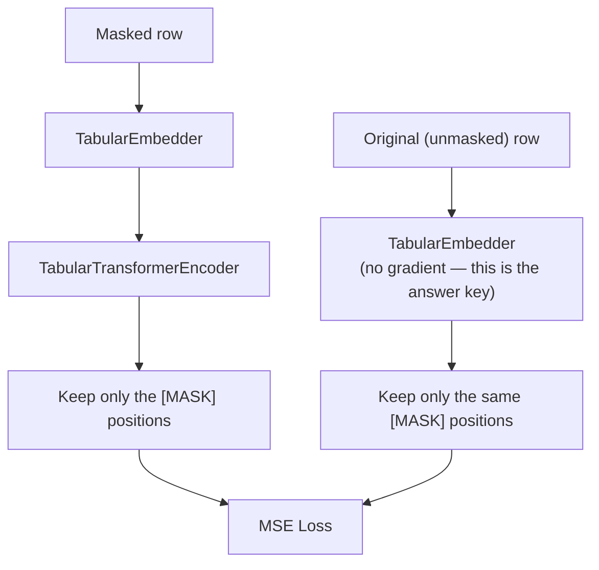

### Implementation

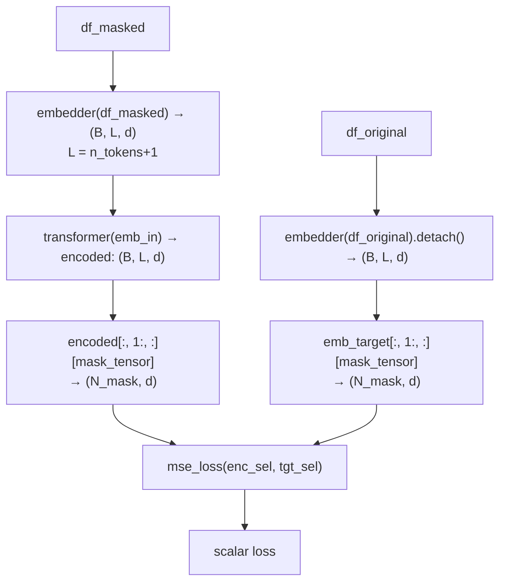

`mask_tensor` (shape `(B, L-1)`) is built by checking, per non-CLS column, whether `df_masked` holds the literal string `"[MASK]"` there — it's derived from the dataframe, not from the embedder's internal `mask_flags`. There's no separate reconstruction/decoder head: the transformer's own contextual output at the masked position *is* the prediction, regressed straight against the clean embedding. If a batch happens to contain zero masks, `forward` returns a zero loss (with a stray debug `print("a")` — a minor rough edge, not a design point).

---

## TridentModel — the fine-tuning / classification head

`src/models.py:60`. This is the class README currently calls `TridentClassifier` — the code names it `TridentModel`. It wraps the *same* embedder and transformer objects `TridentPretrainer` was just using (passed in directly from `pretraining.model.embedder` / `.transformer`, `src/training/finetuning.py:102-107` — not a copy) and adds a small classification head on top of the `[CLS]` output.

### Theory

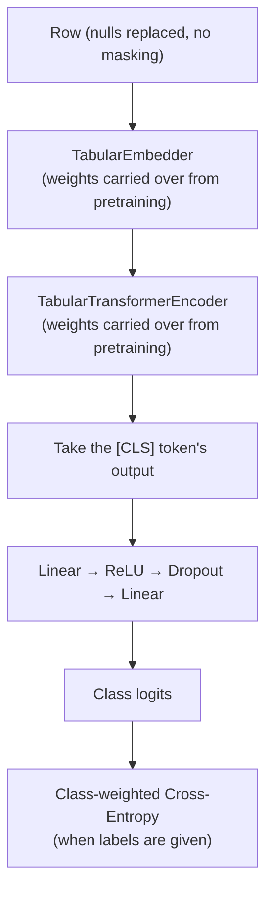

### Implementation

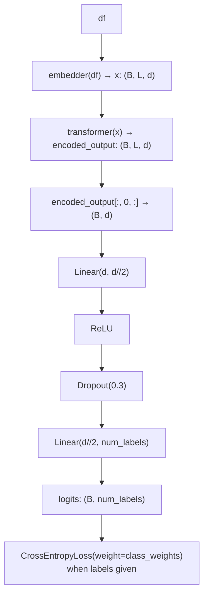

`class_weights` come from `sklearn.utils.class_weight.compute_class_weight("balanced", ...)` computed over the fold's *training* labels only (`finetuning.py:96-101`). The best-validation-loss checkpoint is tracked across all `finetuning_epochs` and restored at the end (a detached clone of `model.state_dict()`) — training always runs the full epoch budget, it just doesn't keep the last epoch's weights if an earlier one scored better on validation loss.

---

## TridentDecoder — reconstructing cell values

`src/models.py`. The imputation task's counterpart to `TridentModel`, added by
[ADR 0004](adr/0004-imputation-decoder-task.md). Where the classifier reads one token
(`[CLS]`) and answers one question, the decoder reads *every* column token and answers a
question per hidden cell: what value was taken away here?

It wraps the *same* embedder and transformer that pre-training produced, exactly as the
classifier does, and adds one head per column. It never re-initialises them.

### Theory

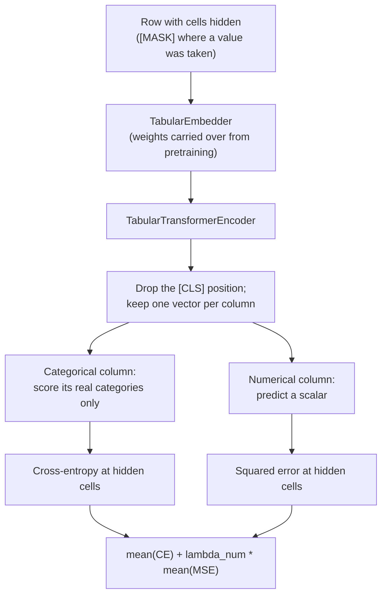

The two terms are averaged over **their own** hidden cells before being summed, so a table
of twenty numerical and two categorical columns cannot drown the categorical term.

### Implementation

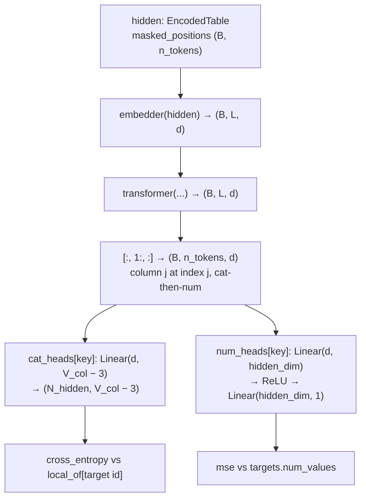

**The output space excludes three vocabulary entries**, and this is the point of the
design rather than a detail. Every categorical vocabulary contains `[MASK]`, `[NULL]` and
the placeholder a missing cell stringifies to (`"nan"`; `as_category_strings` in
`embedder.py` collapses every pandas missing sentinel to that one, so naming it is enough).
None is ever a legitimate imputation, so the head has `V_col − 3` outputs and the target is
remapped through a `local_of` buffer. The excluded ids are looked up through the column's
own `LabelEncoder`, never assumed: classes are sorted, so they land at different positions
in every column.

Two `EncodedTable`s go in. The **hidden** view supplies the context *and*, through
`masked_positions`, says which cells to score; the **clean** view supplies their true
values. Targets are encoded from `preprocess_table(..., fine_tunning=True)` rather than the
raw frame, which is what pre-training encodes: the raw frame puts nulls on the dead
placeholder id and leaves `NaN` in the numerical targets (1400 of them on
`credit-g_20nan`), while the processed frame has neither.

`predict` returns the same three things a caller needs and nothing about how the heads
work: the column's own vocabulary id for each categorical cell, a scalar for each numerical
one, and how sure the head was.

---

## End-to-end training orchestration

`run_training` (`src/training/runner.py:33`) is the function everything above gets called from, once per fold. MLflow's parent-run/fold-run/best-fold/worst-fold tagging is a separate concern, documented in full in [CONTEXT.md](../CONTEXT.md) and [ADR 0002](adr/0002-curated-cross-validation-mlflow-runs.md) — this diagram only shows where the model code above plugs in.

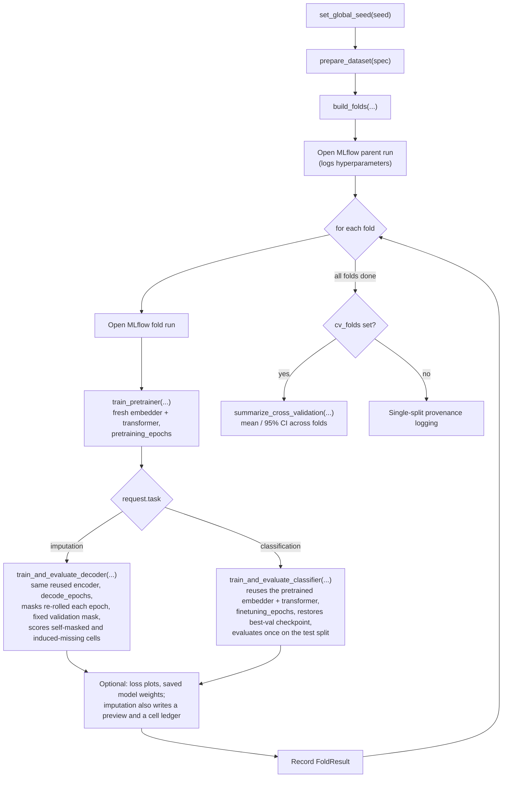

---

## Hyperparameter → code wiring reference

`Hyperparameters` (`src/training/types.py:9`) is the single source of truth; `from_mapping()` translates the legacy JSON keys (the format used in `datasets/hiperparams/{base}/{name}.json` and documented in README's Configuration System) into it.

| Dataclass field | JSON key | Where it actually lands |
|---|---|---|
| `dimension` | `DIM` | `TabularEmbedder.dimensao` = `TabularTransformerEncoder.d_model` — the one embedding width shared by the embedder, the transformer, and (halved) the classifier head |
| `hidden_dimension` | `HIDDEN_DIM` | Hidden width of each numerical column's 2-layer MLP inside `TabularEmbedder` |
| `heads` | `HEADS` | `TabularTransformerEncoder.nhead` → `head_dim = dimension // heads` (must divide evenly) |
| `layers` | `LAYERS` | Number of stacked `EncoderLayer`s |
| `feedforward_dimension` | `DIM_FEED` | `filter_size` inside each `EncoderLayer`'s `FeedForwardNetwork` |
| `dropout` | `DROPOUT` | Dropout rate inside every `EncoderLayer` (attention output + FFN output) |
| `pretraining_epochs` / `finetuning_epochs` | `EPOCHS_PRE` / `EPOCH_FINE` | Epoch counts, and the horizon of each stage's `StageScheduler` |
| `lr_scheduler` | `LR_SCHEDULER` | Which schedule `StageScheduler` (`src/training/schedulers.py`) builds for both stages: `cosine_legacy` (default, per-batch cosine with `T_max=epochs`), `cosine`, `warmup_cosine`, `constant`, `plateau`. Overridable with `--lr_scheduler`; tagged on MLflow runs. See [ADR 0003](adr/0003-selectable-learning-rate-schedule.md) |
| `batch_size` | `BATCH` | Manual batch-slice size in both training loops |
| `pretraining_learning_rate` / `_weight_decay` | `LR_PRE` / `WEIGHT_DECAY_PRE` | `AdamW` for `TridentPretrainer` |
| `finetuning_learning_rate` / `_weight_decay` | `LR_FINE` / `WEIGHT_DECAY_FINE` | `AdamW` for `TridentModel` |
| `mask_probability` | `PROB_MASCARA` | `p_base` passed to `preprocess_table` during pretraining |
| `labels` | `LABELS` | **Metadata only** — logged to MLflow (`runner.py:29`), but the model's real `num_labels` is derived at runtime from `len(dataset.label_classes)` (`finetuning.py:92`), not from this field |

Two gotchas worth remembering:

- The classification head's dropout is **hardcoded to `0.3`** (`src/models.py:88`), independent of the `dropout`/`DROPOUT` hyperparameter that controls the transformer.
- `labels`/`LABELS` doesn't configure anything about the model shape — it's a records-only field. Changing it doesn't change `num_labels`; the dataset does.

---

## Running it

This doc stops at the model and data-pipeline boundary. For actually invoking training — CLI flags, `main.py`/`train.py`/`opt.py`, `--metrics_dir`/`--disable_mlflow`, MLflow run comparisons — see [README.md](../README.md) and [AGENTS.md](../AGENTS.md); those stay the single source of truth for operational usage so this document doesn't drift out of sync with them.
