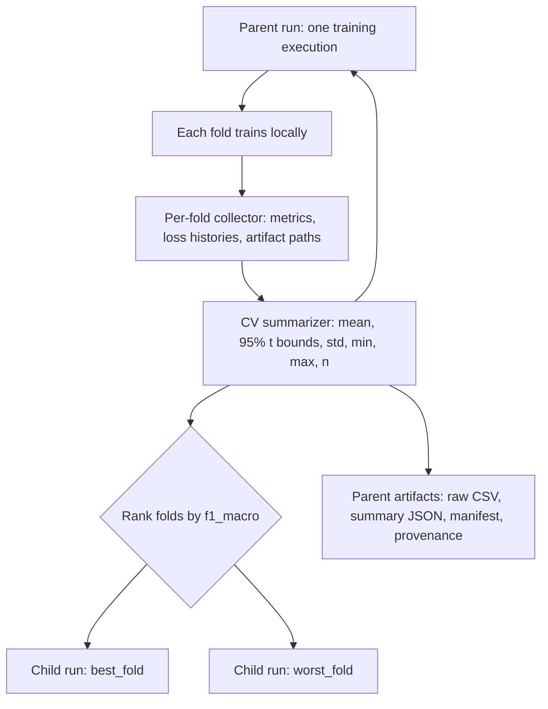

# Use curated diagnostic child runs for cross-validation MLflow tracking

## Status

Accepted

Cross-validation should be compared in MLflow through one parent run per training
execution, not through a table crowded by every fold. The parent retains the
complete, auditable result and records only the folds ranked best and worst by
`f1_macro` as nested diagnostic runs. This follows MLflow's parent/child run
model while keeping the primary comparison surface useful.

## Records

| Record | Parent run | Diagnostic child (`best_fold` / `worst_fold`) |
|---|---|---|
| Parameters and structured tags | Yes | Inherited/role-specific tags |
| Final test metrics | CV summary fields | Raw fold values |
| Losses | Mean/lower/upper series per epoch | Raw epoch histories |
| Dataset lineage | Yes | No duplication |
| Artifacts | Raw-fold CSV, summary JSON, provenance, manifest | Plots and optional model |
| Role tag | `parent` | `best_fold`, `worst_fold`, or `best_and_worst` |

The parent logs `mean`, `ci95_lower`, `ci95_upper`, `std`, `min`, `max`, and
`fold_count` for each final numeric metric. The 95% intervals are Student-t
intervals across folds and are labeled as internal CV uncertainty rather than
independent-test generalization guarantees. The parent logs loss mean and
interval bounds at every epoch for the pre-training and fine-tuning train and
validation series.

Metrics are namespaced for comparison, for example
`cv/test/f1_macro/mean` and `cv/finetune/val_loss/mean`. Diagnostic children
preserve raw metric names such as `test/f1_macro` and `finetune/val_loss`.

All variants of a base dataset remain in `TRIDENT/<base_dataset>`. Parent runs
are tagged `run_role=parent`; diagnostic runs use their corresponding role.
The parent logs the prepared dataset as MLflow input lineage and stores a
provenance artifact containing source, transformations, schema, split
strategy, and fold count. A non-CV execution is one top-level run without a
nested `single_split` run.

## Considered Options

- Parent-only summaries were rejected because they remove direct best/worst
  fold diagnosis.
- Logging every fold as a nested run was rejected because it obscures the
  parent comparison table.
- MLflow logged-model lifecycle management was deferred to
  `docs/tickets/0002-mlflow-logged-model-lifecycle.md`.

## Consequences

Fold-level MLflow events and artifacts must be buffered until ranking is known,
then replayed only for selected diagnostic runs. Raw fold records remain
available through the parent artifacts for auditability.

The MLflow parent/child organization is documented at
https://mlflow.org/docs/latest/ml/tracking/tracking-api/.
