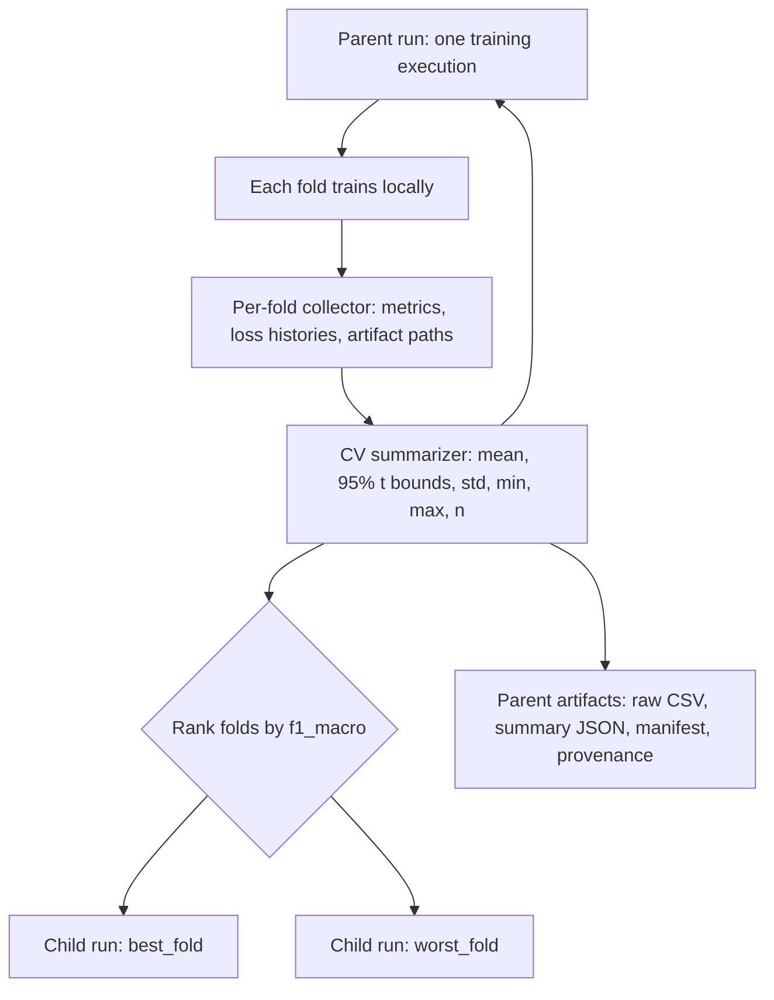

# Curated MLflow Cross-Validation Design

## Goal

Make each TRIDENT training execution easy to compare in MLflow while retaining
enough fold-level evidence to diagnose performance variability. Cross-validation
will use a single parent comparison run plus only the `f1_macro` best and worst
folds as nested diagnostic runs.

## Scope

This design changes experiment tracking and documentation only. It must not
alter data preparation, split/scaling order, random seed behavior, model
architecture, optimization loops, scheduler cadence, metric calculation, CLI
arguments, or `train.main(args, return_metrics=False)` return shape.

## Experiment hierarchy

The existing experiment family naming remains `TRIDENT/<base_dataset>`. Each
top-level run represents one invocation and uses `run_role=parent`. Parent tags
also include `dataset_variant`, `missingness_percent`, and `evaluation_mode`
(`cross_validation` or `single_split`), in addition to the existing dataset,
base-dataset, seed, and run-type tags.

For cross-validation, each fold writes to an in-memory collector during
training. It records raw final metrics, the four epoch histories
(`pretrain/train_loss`, `pretrain/val_loss`, `finetune/train_loss`, and
`finetune/val_loss`), and paths to locally written optional plots/models. It
does not open an MLflow child run while the fold is running. After every fold
has succeeded, the collector produces the parent summary and ranks folds by
`f1_macro`; the parent then opens only the selected nested runs and replays the
corresponding raw histories and optional artifacts.

The largest `f1_macro` selects `best_fold`, the smallest selects `worst_fold`,
and equal values are resolved by the lowest fold number. If they resolve to the
same fold, one child run is logged with `run_role=best_and_worst`. Diagnostic
children retain the raw metric names used today. Generic `mlflow.autolog()` is
not used, so the curated hierarchy is entirely controlled by TRIDENT's manual
tracking adapter.

A predefined single split uses only its top-level parent run: raw epoch
histories, final metrics, optional plots/models, provenance, and artifacts are
logged directly there. It creates no nested `single_split` run and no
cross-validation summaries.

## Parent metrics

For every numeric final fold metric, the CV parent logs:

- `cv/test/<metric>/mean`
- `cv/test/<metric>/ci95_lower`
- `cv/test/<metric>/ci95_upper`
- `cv/test/<metric>/std`
- `cv/test/<metric>/min`
- `cv/test/<metric>/max`
- `cv/test/<metric>/fold_count`

The interval is a two-sided 95% Student-t interval:

`mean ± t(0.975, n - 1) * sample_std / sqrt(n)`.

It is explicitly described in documentation and the summary artifact as
internal CV uncertainty: folds share training data, so it is not an independent
test-set generalization guarantee. `scipy.stats.t` is used for the critical
value, and SciPy is declared as a direct runtime dependency rather than relied
upon transitively.

For every epoch and each of the four existing loss series, the CV parent logs:

- `cv/<phase>/<loss>/mean`
- `cv/<phase>/<loss>/ci95_lower`
- `cv/<phase>/<loss>/ci95_upper`

using the epoch number as the MLflow metric step. Loss bands deliberately omit
std/min/max/count to keep MLflow charts readable.

## Artifacts and lineage

The parent logs these artifacts:

- `metrics/raw_fold_metrics.csv` — all raw fold metrics, preserving the
  project-level CSV data.
- `metrics/cv_summary.json` — summary values, formula metadata, and interval
  interpretation.
- `tracking/diagnostic_manifest.json` — selected fold numbers, roles,
  `f1_macro` ranking values, and retained artifact paths.
- `data/provenance.json` — source CSV path, prepared-data schema,
  label-encoding/scaling description, split strategy, fold count, and seed.

The parent also records MLflow dataset lineage through `mlflow.data.from_pandas`
and `mlflow.log_input(..., context="training")`, using the processed-dataset
CSV path as source. `PreparedDataset` gains typed source and split-path
metadata so lineage does not depend on untyped DataFrame attributes.

Each selected diagnostic child logs its complete raw metric history and, when
enabled, its existing plots and saved model file. No other fold writes an
MLflow child run or child artifact.

## Modules and interfaces

`src/training/summary.py` becomes the deep summary module. Its public
interface accepts completed fold records and produces a typed CV summary,
epoch loss bands, selected diagnostic-fold roles, and serializable artifacts.
It validates that each summary metric is finite and present in every completed
fold, that loss histories have the configured common length, and that at least
two folds are available. Violations raise a clear `ValueError`; no partial or
misleading parent summary is logged.

`src/training/tracking.py` remains the only MLflow seam. The MLflow adapter
manages the top-level run, records parameters/tags/dataset lineage, buffers
per-fold events, logs parent summaries/artifacts, and replays selected fold
records into nested child runs. The disabled adapter exposes the same methods
but does not call any MLflow API.

`src/training/runner.py` continues to orchestrate data, folds, pretraining,
fine-tuning, local artifacts, and the legacy `TrainingResult`. It hands each
completed fold's result, histories, and optional artifact paths to the tracker
and asks it to finalize tracking only after all folds complete.

`src/training/artifacts.py` adds writers for the JSON artifacts above while
continuing to write the existing local raw-metrics CSV and hyperparameters.
`src/training/types.py` adds small immutable values for collected fold tracking
data and CV summaries, plus typed dataset source metadata.

## Error handling

A fold training failure preserves MLflow's failed parent-run status and does
not create partial diagnostic children. A non-finite/missing final metric or
loss history mismatch is a tracking-data error and prevents summary logging.
The raw local artifacts already produced before a failure remain available for
investigation. Single-split execution bypasses all CV validation and summary
logic.

## Verification

New unit tests verify exact Student-t summary values and metric names, loss
bands for all four series, deterministic best/worst/tie selection, and clear
validation failures. Tracking tests use a temporary MLflow backend to assert
the parent role, selected child count/roles, re-played histories, artifact
paths, summary fields, and dataset input lineage. A single-split test asserts
that no nested run is created. The existing disabled-tracking test remains and
continues to prove that no MLflow API is called.

Run the fast suite with `uv run --python 3.10 pytest -m "not integration"`,
then the reviewed regression baseline with
`uv run --python 3.10 pytest -m integration`. The existing
`vehicle_00nan` fixture is not changed because the training algorithm is out
of scope.

## Documentation and deferred work

The README will document how to filter `run_role=parent`, compare
`cv/test/f1_macro/mean` alongside its bounds and standard deviation, and open
the retained diagnostic folds. It will explain the meaning and limitation of
the internal CV interval.

ADR 0002 records the hierarchy and record schema. Ticket 0002 deliberately
defers MLflow logged-model lifecycle work: a stable inference adapter,
signature/input example, model packaging, optional registry policy, and reload
verification are a separate deployment-oriented change.
